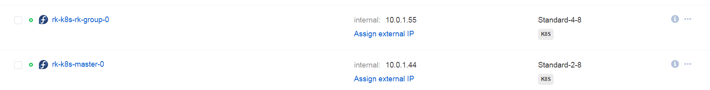
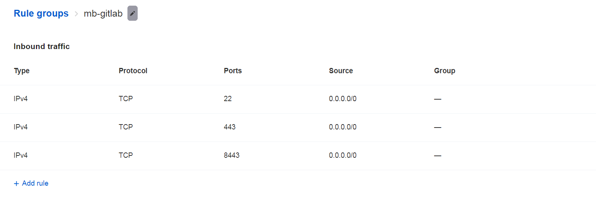

## Infra and APP documention and scripts

### Main paths in repo
#### CI jobs
[CI jobs](configuration/gitlab/repos/ci/vars)
#### APP python code and doc
[SDK API APP](configuration/gitlab/repos/sdk-api/)
#### K8S yamls
[K8S yamls](configuration/gitlab/repos/k8s/)
#### Services Confguration
[configuration](configuration)

### General description  
Infrasturcture for Mercedes-Benz SDK Demo consists of:  
- Gitlab repository manager. Used as primary SCM for any code - from CI jobs to main app;
- Harbor registry manager. Used as modern private registry for all docker images -Jenkins/Jenkins agent/Gitlab/App, etc..;
- Jenkins master/worker. CI system, builds App, validates builds, deploys to Kubernetes cluster;  
- Kubernetes cluster; Provided via MCS Paas but can be deployed via chain Jenkins/Terraform/Ansible/Kubespray, for example.  

### MCS Cloud  
All components run on instances in public MCS cloud:  
- Gitlab and Harbor instance "MB-gitlab" with ip addresses 10.0.1.95 and 89.208.230.154
with exposed ports TCP/8443, TCP/443, TCP/22;
- Jenkins master instance "MB-jenkins-master" with ip addresses 10.0.1.88 and 89.208.231.35
exposed ports are TCP/50000, TCP/443, TCP/22;
- Jenkins worker instance "MB-jenkins-worker" with ip addresses 10.0.1.97 and 89.208.229.119
exposed ports are TCP/50000 and TCP/22;
  
- Kubernetes dev cluster (1 master node  rk-k8s-master-0 ip 10.0.1.44; 1 worker node rk-k8s-rk-group-0 ip 10.0.1.55);  
  

### Security
All public endpoints secured with HTTPS (X.509) self-signed certificates for these domains:
https://jenkins.mb.com
https://gitlab.mb.com
https://harbor.mb.com

Configured Firewall rules (ingress trafic) on instances; 
For example, rules for gitlab instance look like this:  
  

All ssh-servers configured for prohibiting password authentication;

Gitlab authentication via ssh-key or token;

Most of interconnections goes through internal private network (10.0.1.0/24);

### Deployment of Infrastructure
Basically deployment of infrastructure looks like that:
- Create instances for Gitlab/Harbor (4cpu/8ram/100hdd), Jenkins master(2cpu/4ram/60hdd), Jenkins worker(2cpu/4ram/60hdd);
- Create and assign firewall groups with ports mentioned in MCS Cloud paragraph to created instances;  
- Create K8S cluster with any convenient to you way, for example via MCS containers tab; You will need to enable ingress extension;  
- Configure instances and services (right now it's possible only with manual work described in other documents);  
- Configure gitlab - group/user/user keys/api token/projects/web hooks;
- Push code with CI jobs, App source to gitlab;
- Configure Jenkins - worker node/plugins/configuration/credentials/integration with gitlab;
- Run pipelines manually and automatically;
- Check your App exposed via ingress;

### Detailed configuration of instances
- Harbor [Harbor Configuration page](configuration/harbor/README.md)
- Gitlab [Gitlab Configuration page](configuration/gitlab/README.md)
- Jenkins Worker [Jenkins Worker Configuration page](configuration/jenkins-worker/README.md)
- Jenkins Master [Jenkins Master Configuration page](configuration/jenkins-master/README.md)

### K8S Resources
K8S resources can be found in repository 
ssh://git@gitlab.mb.com:2200/mercedes/sdk-api.git
in branch K8S

OR  locally in this repo 
configuration/gitlab/repos/k8s/

This stateless app is pretty easy for deploying in K8S, so you'll find these resources:
- limitRange resource for ns
- deployment
- service
- secret for registry
- secret tls for ingress
- ingress
